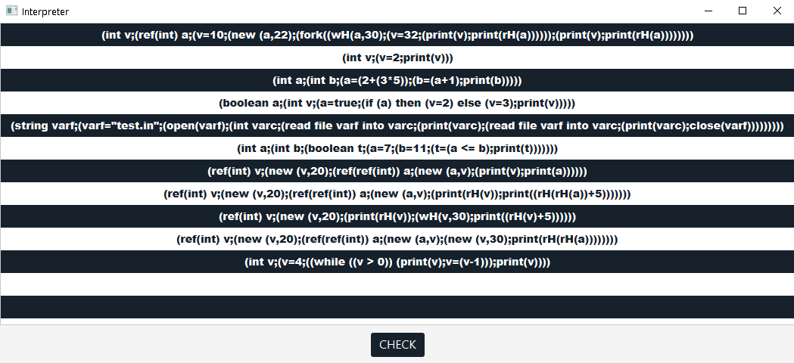
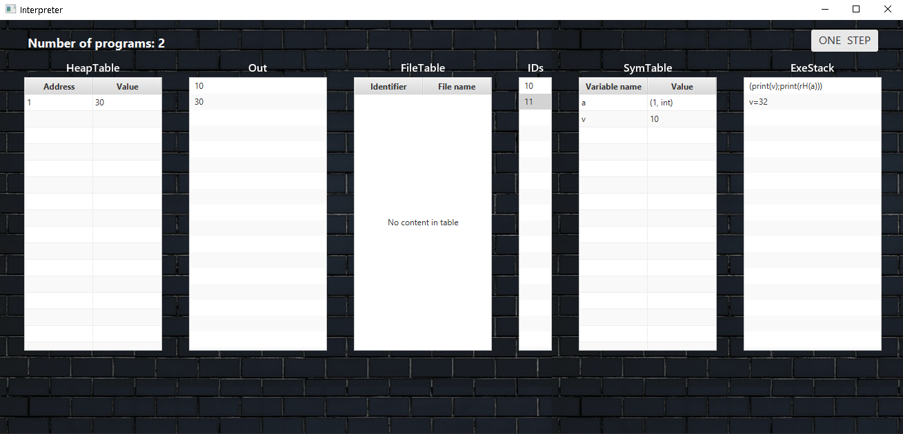

# Java-Interpreter
An interpreter developed using the MVC Pattern in Java and providing a GUI interface created with JavaFX.

The application works by running, one by one, each instruction in the execution stack. At each step, the user can see what each structure contains: what are the values printed on the screen, what the variables declared are, how many processes there are etc. A normal run consists of choosing the program to run from a list (and also checking if the types are correct by pressing the "CHECK" button) and then running "ONE STEP" until the execution stack is empty and the number of programs becomes 0.

# Available features
There are currently 11 hardcoded examples available in the "ControllerProgramPicker.java" module. In order to add new "programs" just follow the already existing ones.
Currently, the following are available:
### Types and Values: 
IntType/IntValue -> integers
BoolType/BoolValue -> booleans
StringType/StringValue -> strings
RefType/RefValue -> references to another type
### Structures:
ExecutionStack-> contains each instruction in order
SymbolsTable -> contains the variables declared on the stack
HeapTable -> contains the variables declared on the heap
FileTable -> contains a table of open files
TypeEnvironment -> responsible for assuring the correctness of each type before the initialization of the program
### Expressions:
Expressions dealing with values/variables: ValueExpression, VariableExpression
Expressions responsible for computing/comparing: ArithmeticExpression, LogicalExpression, RelationalExpression
Expressions working with the heap: HeapReadingExpression
### Statements:
Statements responsible for computing/comparing: AssignmentStatement
Statements working with the heap: HeapWritingStatement, NewStatement
Statements working with files: OpenRFileStatement, CloseRFileStatement, ReadFileStatement
Statements for multithreading: ForkStatement
General Statements: CompoundStatement, PrintStatement, WhileStatement, VariableDeclarationStatement, IfStatement, NopStatement


# Requirements
In order to run the application the JavaFX package has to be installed.

# Usage
Just clone the repository and open the project in an IDE if your choice (preferably IntelliJ).
```
git clone https://github.com/neutralove/Java-Interpreter.git
```

# Preview




